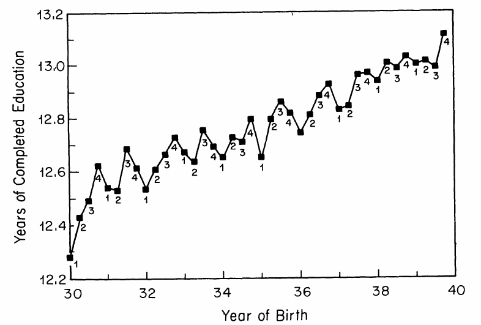
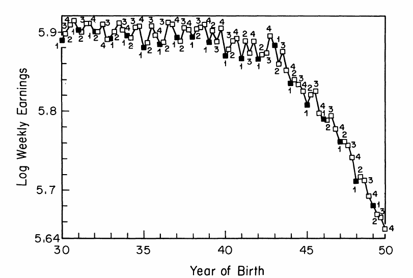

# Discussion of IV {.section-slide}

## Setting {.small-slide}

:::: {.columns}

::: {.column width="70%"}
- Suppose $\beta_1$ is the [true]{.alert} causal effect of $X$ on $Y$ in the linear regression:
$$
Y_{i} = \beta_0 + \beta_1 X_{i} + u_{i}, \quad i=1, \ldots, N
$$
- For all $\hat{\beta}_{i}^{OLS}$ to be consistent, we need:
$$
\mathbb{E}[u_i|X_i] = 0
$$
i.e. $X_i$ is **exogenous** and contains no information on $u_i$.
- When $\mathbb{E}[u_i|X_i] \ne 0$, $X_i$ is **endogenous** and $\hat{\beta}_{i}^{OLS}$ becomes inconsistent (invalid even in large samples).
- Example: The effect of `EDUC` on `LWKLYWGE` [@angrist1991does], where $\text{Cov(X, U)}>0$
:::

::: {.column width="30%"}
[Example]{.highlight .center}
```{mermaid}
%%| echo: false
flowchart TD
    X["X: EDUC"] -->|Causal effect| Y["Y: LWKLYWGE"]
    
    U["U: Ability"] --> X
    U --> Y
```
:::

::::


## Quiz: Threats to Internal Validity {.quiz-question .small-slide}

What are potential threats to internal validity?

- Omitted variables bias
- Measurement error in an independent variable
- Sample selection bias
- Simultaneity
- [All of the above]{.correct}

## IV: Basic Idea {.small-slide}

:::: {.columns}

::: {.column width="60%"}
- For the equation:
$$
Y_{i} = \beta_0 + \beta_1 X_{i} + u_{i}
$$
IVs decompose $X$ into two parts that are uncorrelated:
$$
X_{i} = \gamma_0 + \gamma_1 Z_{i} + v_{i}
$$
    - $\text{Cov}(Z, u) = 0$: the part uncorrelated with $u$
    - $\text{Cov}(v, u) \ne 0$: the part correlated with $u$ and the source of endogeneity
    - with $\text{Cov}(Z,v) = 0$
- $Z_{i}$ is an [instrumental variable]{.fg}
:::

::: {.column width="40%"}
[Example: AK (1991)]{.highlight .center}

[$\text{Cov}(X, U) \ne 0$]{.center}

```{mermaid}
%%| echo: false
flowchart TD
    Z["Z: Instrument (QOB)"] -->|Relevance| X["X: EDUC"]
    X -->|Causal effect| Y["Y: LWKLYWGE"]
    
    U["U: Ability"] --> X
    U --> Y
    
    Z -.-o|No direct effect - Exclusion| Y
```
:::

::::

## Conditions for a Valid Instrument {.small-slide}

A *valid* instrumental variable must satisfy two conditions:

::: {.incremental}
1. [Instrument relevance]{.fg}: $\text{Cov}(Z_{i}, X_{i}) \ne 0$
     - We observe both $X$ and $Z$ and can test this assumption by regressing:
    $$
    X_{i} = \gamma_0 + \gamma_1 Z_{i} + v_{i}
    $$
    - If $\gamma_1 \ne 0$ $\implies$ instrument is relevant
2. [Instrument exogeneity]{.fg}: $\text{Cov}(Z_{i}, u_{i}) = 0$
     - $u_{i}$ is unobservable, so we [cannot]{.alert} test this assumption
     - Must defend this assumption by explaining why $Z$ and $u$ are unlikely to be correlated
:::

## IV Regression with Continuous $Z$ {.small-slide}

Consider the same model:
$$
Y_{i} = \beta_0 + \beta_1 X_{i} + u_{i}
$$

- $Z$ is continuous
- To capture the indirect effect of $Z$:
$$
\begin{aligned}
\text{Cov}(Y_{i},Z_{i}) &= \text{Cov}(\beta_0 + \beta_1 X_{i} + u, Z_{i}) \\
&= \beta_1 \text{Cov}(X_{i}, Z_{i}) \quad \text{since } \text{Cov}(Z_{i}, u_{i}) = 0
\end{aligned}
$$
- Rearranging, we get the [instrumental variable estimator]{.fg}:
$$
\begin{aligned}
\beta_{1}^{IV} &= \frac{\text{Cov}(Y_{i},Z_{i})}{\text{Cov}(X_{i}, Z_{i})}\\
& =\frac{s_{YZ}}{s_{ZX}}
\end{aligned}
$$

## Large Sample Properties of $\beta_{1}^{IV}$ {.small-slide}

[Consistency]{.fg}

Due to LLN, $s_{YZ} \xrightarrow{p} \text{Cov}(Z_i, Y_i)$ and $s_{XZ} \xrightarrow{p} \text{Cov}(Z_i, X_i)$.

It follows: 
$$
\beta_{1}^{IV} = \frac{s_{YZ}}{s_{ZX}} \xrightarrow{p} = \frac{\text{Cov}(Z_i, Y_i)}{\text{Cov}(Z_i, X_i)} = \beta_1
$$

:::{.center}
[$\beta_{1}^{IV}$ is consistent]{.alert}
:::

[Normality]{.fg}

Due to CLT,
$$
\beta_{1}^{IV} \stackrel{a}{\sim} N(\beta_1, \sigma^{2}_{\hat{\beta}_{1}^{TSLS}}) \quad \text{ where,}
$$
$$
\sigma^{2}_{\hat{\beta}_{1}^{TSLS}} = \frac{1}{n}\frac{\mathbb{V}[(Z_i - \mu_Z)u_i]}{[\text{Cov}(Z_{i}, X_{i})]^2}
$$


## Two Stage Least Squares (TSLS) Estimator {.small-slide}

- Suppose we have an instrument $Z$ that satisfies both instrument relevance and exogeneity conditions.
- We can estimate $\beta_1$ using a two-step procedure:
    - **First stage regression**: Regress $X$ on $Z$ (reduced form equation for $X$):
      $$
      X_{i} = \gamma_0 + \gamma_1 Z_{i} + v_{i}
      $$
      Apply OLS and obtain predicted values $\hat{X}_{i}$
    - **Second Stage regression**: Regress $Y_{i}$ on $\hat{X}_{i}$
      $$
      Y_{i} = \beta_0 + \beta_1 \hat{X}_{i} + u_{i}
      $$
      The TSLS estimators $\beta_{0}^{TSLS}$ and $\beta_{1}^{TSLS}$ are obtained from the second stage regression.

## Angrist and Krueger (1991) {.tiny-slide .quote-slide}

> "The experiment stems from the fact that children born in different months of the year start school at different ages, while compulsory schooling laws generally require students to remain in school until their sixteenth or seventeenth birthday"

:::: {.columns}

::: {.column width="48%"}

:::

::: {.column width="48%"}

:::

::::


## Angrist and Krueger (1991) {.tiny-slide}

:::: {.columns}

::: {.column width="60%"}
```{r}
#| eval: false
# Angrist and Krueger (1991) - Table IV

# load packages and data --------------------
library("dplyr")
library("janitor")
library("haven")
library("modelsummary")
library("ivreg")

ak91 <- read_dta(paste0(path, "/ak91.dta"))

# clean data and create variables ------------------------
ak91 <- ak91 %>% clean_names()

yr_v <- grep("^yr", names(ak91), value = TRUE)
yr_v <- yr_v[yr_v %in% "yr9" == FALSE]

qtr1_v <- grep("^qtr1", names(ak91), value = TRUE)
qtr1_v <- qtr1_v[qtr1_v %in% "qtr1" == FALSE]

qtr2_v <- grep("^qtr2", names(ak91), value = TRUE)
qtr2_v <- qtr2_v[qtr2_v %in% "qtr2" == FALSE]

qtr3_v <- grep("^qtr3", names(ak91), value = TRUE)
qtr3_v <- qtr3_v[qtr3_v %in% "qtr3" == FALSE]

X_exog <- c(
    "race",
    "married",
    "smsa",
    "neweng",
    "midatl",
    "enocent",
    "wnocent",
    "soatl",
    "esocent",
    "wsocent",
    "mt",
    "ageq",
    "ageqsq"
)
X_endog <- "educ"
Z_inst <- c(yr_v, qtr1_v, qtr2_v, qtr3_v)


# OLS model
ols_fml <- as.formula(
    paste(
        "lwklywge ~",
        paste(c(X_endog, X_exog, yr_v), collapse = " + ")
    )
)
ols_model <- lm(ols_fml, data = ak91)

# IV model
iv_fml <- as.formula(
    paste(
        "lwklywge ~",
        paste(c(X_exog, yr_v), collapse = " + "),
        "|",
        X_endog,
        "|",
        paste(Z_inst, collapse = " + ")
    )
)
iv_model <- ivreg(iv_fml, data = ak91)

m_list <- list(
    "OLS" = ols_model,
    "IV" = iv_model
)

msummary(m_list)
```
:::

::: {.column width="40%"}
Dependent variable: log weekly wages

+--------------+----------+---------+
|              | OLS      | IV      |
+==============+==========+=========+
| Education    | 0.070*** | 0.103** |
+--------------+----------+---------+
|              | (0.000)  | (0.033) |
+--------------+----------+---------+
| Observations | 247199   | 247199  |
+--------------+----------+---------+
| R²           | 0.230    | 0.204   |
+==============+==========+=========+
| + p < 0.1, * p < 0.05, ** p <     |
| 0.01, *** p < 0.001               |
+==============+==========+=========+

$\beta_{1}^{TSLS} > \beta_{1}^{OLS}$ : school "completion" effect due to compulsory schooling.
:::

::::

# Tutorial {.section-slide}


## References {.tiny-slide}