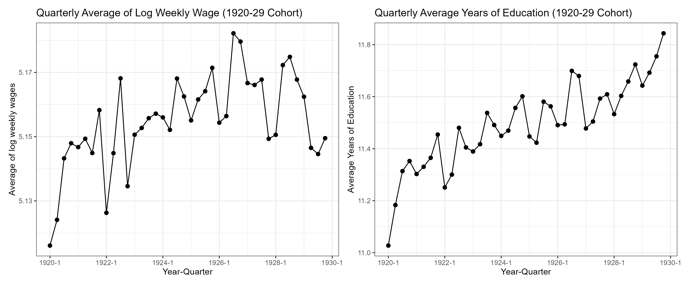
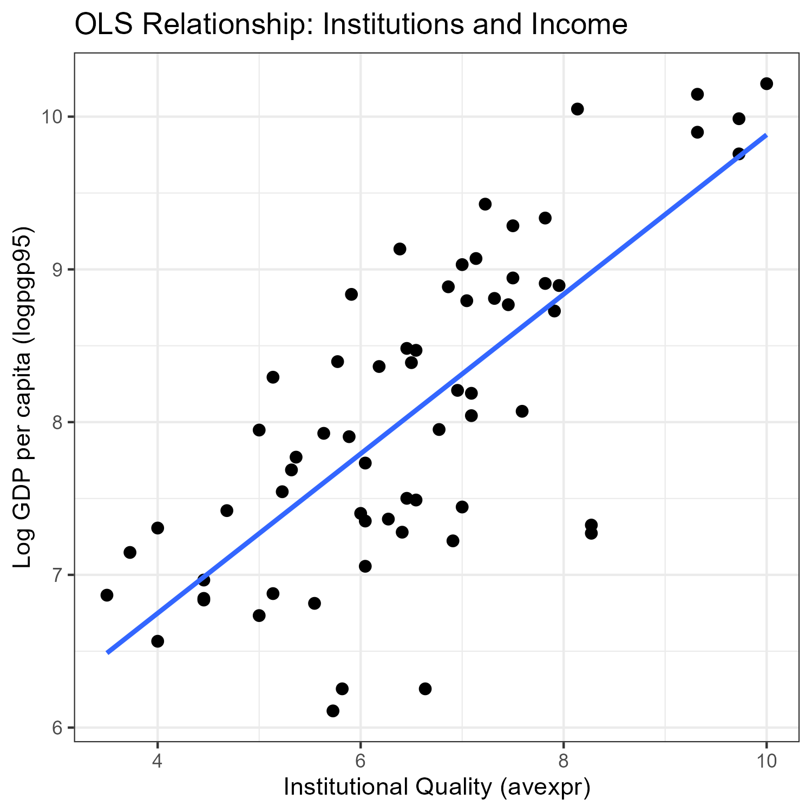
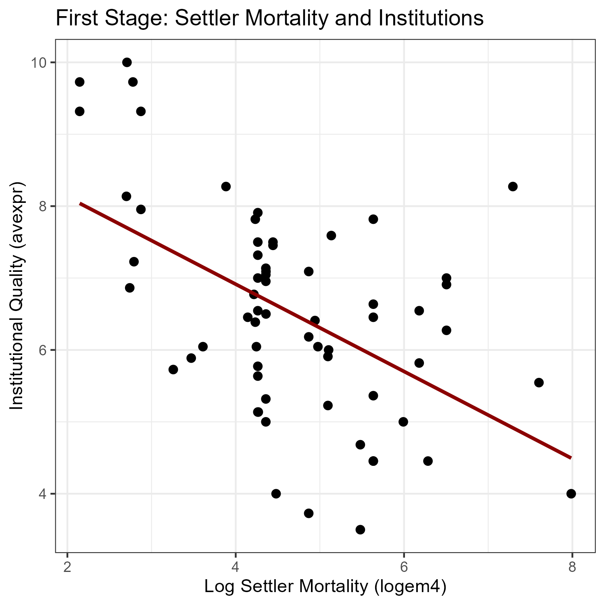

## Setting {.small-slide}

:::: {.columns}

::: {.column width="70%"}
- Suppose our interest lies in estimating $\beta_1$, the causal effect of $X$ on $Y$, in the linear regression:
$$
Y_{i} = \beta_0 + \beta_1 X_{i} + u_{i}, \quad i=1, \ldots, N
$$
- $\hat{\beta}^{OLS}$ is consistent for $\beta$ if:
$$
\mathbb{E}[u_i|X_i] = 0
$$
i.e. $X_i$ is **exogenous** and contains no information on $u_i$.
- When $\mathbb{E}[u_i|X_i] \ne 0$, $X_i$ is **endogenous** and $\hat{\beta}^{OLS}$ is [inconsistent]{.fg} (i.e. invalid even in large samples).
- Example: @angrist1991does study the effect of compulsory schooling laws in the US on returns to education (see DAG).
:::

::: {.column width="30%"}
[DAG: Omitted Variable]{.highlight .center}
```{mermaid}
%%| echo: false
flowchart TD
    X["X: Education"] -->|Causal effect| Y["Y: Earnings"]
    
    U["U: Ability"] --> X
    U --> Y
```
:::

::::

## OVB and Inconsistency of OLS {.small-slide}

- Suppose the dgp is:
$$
Y_{i} = \beta_{0} + \beta_{1} X_{i} + \beta_{2} {\color{orange} A_{i}} + u_{i}
$$
where ${\color{orange} A_{i}}$ is the *omitted* (but relevant) variable and $\mathbb{E}[u_i|X_i {\color{orange} A_{i}}] =0$
- If we omit ${\color{orange} A_{i}}$ we estimate:
$$
Y_{i} = \alpha_0 + \alpha_1 X_i + v_{i}
$$
where $v_{i}$ is now the composite error $v_{i} = \beta_{2} {\color{orange} A_{i}} + u_{i}$
- We can show that (exercise):
$$
\text{plim } \hat{\alpha}_{1}^{OLS} = \beta_{1} + \frac{\text{Cov}(x_i, {\color{orange} A_{i}})}{\mathbb{V}(x)}
$$

<!-- ## Other Potential Threats to Internal Validity

Besides omitted variables, OLS is inconsistent if there is:

- Measurement error in an independent variable (e.g. voting intention)
- Sample selection bias (e.g. job training program)
- Simultaneity and feedback (e.g. demand estimation)

IVs create [exogenous variation]{.fg} to identify causal impact. -->

<!-- ## Quiz: Threats to Internal Validity {.quiz-question .small-slide}

What are common potential threats to internal validity?

- Omitted variables bias
- Measurement error in an independent variable
- Sample selection bias
- Simultaneity
- [All of the above]{.correct} -->

## Instrumental Variable: Basic Idea {.small-slide}

:::: {.columns}

::: {.column width="60%"}
- For the equation:
$$
Y_{i} = \beta_0 + \beta_1 X_{i} + u_{i}
$$
IVs decompose $X$ into two parts that are uncorrelated:
$$
X_{i} = \gamma_0 + \gamma_1 Z_{i} + v_{i}
$$
    - $\text{Cov}(Z_i, u_i) = 0$: the part uncorrelated with $u_i$
    - $\text{Cov}(v_i, u_i) \ne 0$: the part correlated with $u_i$ and the source of endogeneity
    - with $\text{Cov}(Z_i,v_i) = 0$
- $Z_{i}$ is an [instrumental variable]{.fg}
:::

::: {.column width="40%"}
[Example: AK (1991)]{.highlight .center}

[$\text{Cov}(X, U) \ne 0$]{.center .smaller}

```{mermaid}
%%| echo: false
flowchart TD
    Z["Z: Instrument (QOB)"] -->|Relevance| X["X: Education"]
    X -->|Causal effect| Y["Y: Earnings"]
    
    U["U: Ability"] --> X
    U --> Y
    
    Z -.-|No direct effect - Exclusion| Y
```
:::

::::

## Conditions for a Valid Instrument {.small-slide}

A *valid* instrumental variable must satisfy two conditions:

::: {.fragment}
1. [Instrument relevance]{.fg}: $\text{Cov}(Z_{i}, X_{i}) \ne 0$
     - We observe both $X$ and $Z$ and can test this assumption by regressing:
    $$
    X_{i} = \gamma_0 + \gamma_1 Z_{i} + v_{i}
    $$
    - If $\gamma_1 \ne 0$ $\implies$ instrument is relevant
:::

::: {.fragment}
2. [Instrument exogeneity]{.fg}: $\text{Cov}(Z_{i}, u_{i}) = 0$
     - $u_{i}$ is unobservable, so we [cannot]{.alert} test this assumption
     - Must defend this assumption by explaining why $Z_i$ and $u_i$ are unlikely to be correlated
:::

## IV Regression with Continuous $Z$ {.small-slide}

Consider the same model:
$$
Y_{i} = \beta_0 + \beta_1 X_{i} + u_{i}, \quad \mathbb{E}[u_{i}|X_{i}]\ne 0
$$

- $Z$ is continuous
- Taking $\text{cov}$ of above eq. w.r.t $Z_{i}$ (linear operator), we get:
$$
\begin{aligned}
\text{Cov}(Y_{i},Z_{i}) &= \text{Cov}(\beta_0 + \beta_1 X_{i} + u_i, Z_{i}) \\
&= \beta_1 \text{Cov}(X_{i}, Z_{i}), \quad\quad [\text{since } \text{Cov}(Z_{i}, u_{i}) = 0]
\end{aligned}
$$
- Rearranging, we get the [instrumental variable estimator]{.fg}:
$$
\boxed{\beta_{1}^{IV} = \frac{\text{Cov}(Y_{i},Z_{i})}{\text{Cov}(X_{i}, Z_{i})} =\frac{s_{YZ}}{s_{ZX}}}
$$

## Large Sample Properties of $\beta_{1}^{IV}$ {.small-slide}

[Consistency:]{.fg} Due to LLN, $s_{YZ} \xrightarrow{p} \text{Cov}(Z_i, Y_i)$ and $s_{XZ} \xrightarrow{p} \text{Cov}(Z_i, X_i)$. It follows that: 
$$
\boxed{\beta_{1}^{IV} = \frac{s_{YZ}}{s_{ZX}} \xrightarrow{p} \frac{\text{Cov}(Z_i, Y_i)}{\text{Cov}(Z_i, X_i)} = \beta_1}
$$

<!-- :::{.center}
[$\beta_{1}^{IV}$ is consistent]{.alert}
::: -->

[Normality:]{.fg} From the CLT,
$$
\beta_{1}^{IV} \stackrel{a}{\sim} N(\beta_1, \sigma^{2}_{\hat{\beta}_{1}^{TSLS}}) \quad \text{ where,}
$$
$$
\boxed{\sigma^{2}_{\hat{\beta}_{1}^{IV}} = \frac{1}{n}\frac{\mathbb{V}[(Z_i - \mu_Z)u_i]}{[\text{Cov}(Z_{i}, X_{i})]^2}}
$$


## Two Stage Least Squares (TSLS) Estimator {.small-slide}

- Suppose we have an instrument $Z$ that satisfies both instrument relevance and exogeneity conditions.
- Recall, $\beta_{1}^{IV} = \frac{\text{Cov}(Y_{i},Z_{i})}{\text{Cov}(X_{i}, Z_{i})} \implies \frac{\text{Cov}(Y_{i},Z_{i})/V(Z_{i})}{\text{Cov}(X_{i}, Z_{i})/V(Z_i)} = \frac{\text{Reduced form}}{\text{First stage}}$
- We can estimate $\beta_1$ using a two-step process:
    - [First stage regression]{.fg}: Regress $X$ on $Z$ using OLS:
      $$
      X_{i} = \gamma_0 + \gamma_1 Z_{i} + v_{i}
      $$
      and obtain predicted values $\hat{X}_{i}$
    - [Second stage regression]{.fg}: Regress $Y_{i}$ on $\hat{X}_{i}$
      $$
      Y_{i} = \beta_0 + \beta_1 \hat{X}_{i} + u_{i}
      $$
      The TSLS estimators $\beta_{0}^{TSLS}$ and $\beta_{1}^{TSLS}$ are obtained from the second stage regression.
      [Note:]{.warning} OLS s.e. of second stage regression is incorrect. Use statistical software for estimation.


## Example: Angrist and Krueger (1991) {.tiny-slide .quote-slide}

> "The experiment stems from the fact that children born in different months of the year start school at different ages, while compulsory schooling laws generally require students to remain in school until their sixteenth or seventeenth birthday"

```{r}
#| echo: true
#| eval: false
#| code-fold: true
#| code-summary: "expand for full code"
# load libraries -------------------------
library("haven")
library("janitor")
library("dplyr")
library("zoo")
library("ggplot2")
library("patchwork")

ak91 <- read_dta(paste0(path, "/ak91_2029.dta"))

# clean data and create variables ------------------------
ak91 <- ak91 %>%
    clean_names() %>%
    mutate(yob = yob + 1900)

ak91 <- ak91 %>%
    mutate(
        yr_qtr = as.yearqtr(paste(yob, qob), format = "%Y %q")
    )

# average yr_qtr data -------------------------------
ak91_qtr <- ak91 %>%
    group_by(yr_qtr) %>%
    summarise(
        lwklywge_mean = mean(lwklywge, na.rm = TRUE),
        educ_mean = mean(educ, na.rm = TRUE)
    )

# plot and save ------------------------------------
rf_plot <- ggplot(ak91_qtr, aes(x = yr_qtr, y = lwklywge_mean)) +
    geom_point(size = 2) +
    geom_line() +
    labs(
        x = "Year-Quarter",
        y = "Average of log weekly wages",
        title = "Quarterly Average of Log Weekly Wage (1920-29 Cohort)"
    ) +
    theme_bw()
rf_plot

inst_plot <- ggplot(ak91_qtr, aes(x = yr_qtr, y = educ_mean)) +
    geom_point(size = 2) +
    geom_line() +
    labs(
        x = "Year-Quarter",
        y = "Average Years of Education",
        title = "Quarterly Average Years of Education (1920-29 Cohort)"
    ) +
    theme_bw()
inst_plot

ggsave(
    "ak91_2029_combined.png",
    rf_plot + inst_plot,
    width = 12,
    height = 5,
    dpi = 300
)
```




## Angrist and Krueger (1991) {.tiny-slide .center}

```{r}
#| echo: true
#| eval: false
#| code-fold: true
#| code-summary: "expand for full code"
# Angrist and Krueger (1991) - Table IV - Col (7) and (8)

# load packages and data --------------------
library("modelsummary")
library("ivreg")

# create variables for regression -------------------------
yr_v <- grep("^yr", names(ak91), value = TRUE)
yr_v <- yr_v[yr_v %in% "yr9" == FALSE]

qtr1_v <- grep("^qtr1", names(ak91), value = TRUE)
qtr1_v <- qtr1_v[qtr1_v %in% "qtr1" == FALSE]

qtr2_v <- grep("^qtr2", names(ak91), value = TRUE)
qtr2_v <- qtr2_v[qtr2_v %in% "qtr2" == FALSE]

qtr3_v <- grep("^qtr3", names(ak91), value = TRUE)
qtr3_v <- qtr3_v[qtr3_v %in% "qtr3" == FALSE]

# gather variables -------------------------------
X_exog <- c(
    "race",
    "married",
    "smsa",
    "neweng",
    "midatl",
    "enocent",
    "wnocent",
    "soatl",
    "esocent",
    "wsocent",
    "mt",
    "ageq",
    "ageqsq"
)
X_endog <- "educ"
Z_inst <- c(yr_v, qtr1_v, qtr2_v, qtr3_v)

# OLS model ------------------------------------
ols_fml <- as.formula(
    paste(
        "lwklywge ~",
        paste(c(X_endog, X_exog, yr_v), collapse = " + ")
    )
)
ols_model <- lm(ols_fml, data = ak91)
summary(ols_model)

# IV model -------------------------------------
iv_fml <- as.formula(
    paste(
        "lwklywge ~",
        paste(c(X_exog, yr_v), collapse = " + "),
        "|",
        X_endog,
        "|",
        paste(Z_inst, collapse = " + ")
    )
)
iv_model <- ivreg(iv_fml, data = ak91)
summary(iv_model)

# print results --------------------------------
m_list <- list(
    "OLS" = ols_model,
    "IV" = iv_model
)

cm <- c("educ" = "Education")

gm <- list(
    list("raw" = "nobs", "clean" = "Observations", "fmt" = 0),
    list("raw" = "r.squared", "clean" = "R²", "fmt" = 3)
)

msummary(m_list, stars = TRUE, gof_map = gm, coef_map = cm, output = "markdown")
```

Dependent variable: log weekly wages

+--------------+----------+---------+
|              | OLS      | IV      |
+==============+==========+=========+
| Education    | 0.070*** | 0.103** |
+--------------+----------+---------+
|              | (0.000)  | (0.033) |
+--------------+----------+---------+
| Observations | 247199   | 247199  |
+--------------+----------+---------+
| R²           | 0.230    | 0.204   |
+==============+==========+=========+
| + p < 0.1, * p < 0.05, ** p <     |
| 0.01, *** p < 0.001               |
+==============+==========+=========+

$\beta_{1}^{TSLS} > \beta_{1}^{OLS}$ : school "completion" effect due to compulsory schooling.

## What's Next? {.small-slide}

- General IV regression (additional regressors, multiple instruments)
  - Sargan J-Test of overidentifying restriction
- Weak Instruments [@stock2002testing; @andrews2019weak]
  - AK(1991) reanalysis [@bound1995problems]
  - Anderson-Rubin test
- Heterogenous treatment effects (LATE vs. ATE)
  - Compliers, Always takers, Never takers, Defiers

<!-- # Tutorial {.section-slide} -->

## Exercise Sheet {.tiny-slide}




<!-- ## AJR (2001) {.tiny-slide .quote-slide}

Acemoglu, Daron, Simon Johnson, and James A. Robinson. 2001. "The Colonial Origins of Comparative Development: An Empirical Investigation." American Economic Review 91 (5): 1369–1401. [[link]](https://www.aeaweb.org/articles?id=10.1257/aer.91.5.1369)

> We exploit differences in European mortality rates to estimate the effect of institutions on economic performance. Europeans adopted very different colonization policies in different colonies, with different associated institutions. In places where Europeans faced high mortality rates, they could not settle and were more likely to set up extractive institutions. These institutions persisted to the present. Exploiting differences in European mortality rates as an instrument for current institutions, we estimate large effects of institutions on income per capita. Once the effect of institutions is controlled for, countries in Africa or those closer to the equator do not have lower incomes.
- @acemoglu2001colonial


Read about their contribution [2024 Nobel Prize in Economics](https://www.nobelprize.org/prizes/economic-sciences/2024/popular-information/)  -->

## AJR (2001): Main Idea {.small-slide}

:::: {.columns}

::: {.column width="60%"}
- AJR considers:
$$
\log y_{i} = \mu + \alpha R_{i} + \mathbf{X}'_{i}\gamma + u_{i}
$$
where,
    - $y_{i}$ is income per capita
    - $R_{i}$ protection against expropriation measure
    - $\mathbf{X}_i$ vector of other variables
    - $u_{i}$ is random error.
- Here, $\text{Cov}(R_{i}, u_{i}) \ne 0$ and OLS is inconsistent.
- $R_{i}$ modeled as:
$$
R_{i} = \zeta + \beta \log M_{i} + \mathbf{X}'_{i} \delta + v_{i} 
$$
where $\log M_{i}$, the settler mortality rate is used to instrument $R_{i}$.

:::

::: {.column width="40%"}
[AJR (2001)]{.highlight .center}

```{mermaid}
%%| echo: false
flowchart TD
    Z["Z: Settler mortality (M)"] -->|Relevance| X["R: Institution"]
    X -->|Causal effect| Y["Y: Income"]
    
    U["U"] --> X
    U --> Y
    Y --> |"Feedback"| X
    
    Z -.-|"Exclusion Restriction"| Y
```
:::

::::


## OLS Estimates {.small-slide}


:::: {.columns}

::: {.column width="60%"}
```{r}
#| echo: true
#| eval: false
#| code-fold: false
#| code-summary: "expand for full code"
# AJR 2001: Table 5

# get data ------------------------
ajr01 <- read_dta("./data/maketable5.dta")
ajr01 <- ajr01 %>% filter(baseco == 1)

X_exog <- c("lat_abst", "f_french", "sjlofr", "catho80", "muslim80", "no_cpm80")
X_endog <- "avexpr"
Z_inst <- "logem4"

# OLS model ------------------------------------
ols_fml <- as.formula(
    paste(
        "logpgp95 ~",
        paste(c(X_endog, X_exog), collapse = " + ")
    )
)
ols_ajr <- lm(ols_fml, data = ajr01)
# summary(ols_ajr)

# coeftest(ols_ajr, vcov = vcovHC(ols_ajr, type = "HC1"))

# plot relationship ----------
lm_plot <- ggplot(ajr01, aes(x = avexpr, y = logpgp95)) +
    geom_point(size = 2) +
    geom_smooth(method = "lm", se = FALSE) +
    labs(
        title = "OLS Relationship: Institutions and Income",
        x = "Institutional Quality (avexpr)",
        y = "Log GDP per capita (logpgp95)"
    ) +
    theme_bw()
lm_plot
```
:::

::: {.column width="40%"}

:::

::::

## Quiz: Endogeneity {.quiz-question .small-slide}

Why is OLS biased in the AJR setting?

- Measurement error only
- [Reverse causality and omitted variables]{.correct}
- Small sample size
- Incorrect standard errors

## First Stage Regression {.small-slide}

:::: {.columns}

::: {.column width="60%"}
```{r}
#| echo: true
#| eval: false
#| code-fold: false
#| code-summary: "expand for full code"
# first stage ---------------------------------
fs_fml <- as.formula(
    paste(
        X_endog,
        "~",
        paste(c(Z_inst, X_exog), collapse = " + ")
    )
)
fs_ols <- lm(fs_fml, data = ajr01)
summary(fs_ols)

linearHypothesis(fs_ols, "logem4 = 0")

# plot first stage relationship -------------------
fs_plot <- ggplot(ajr01, aes(x = logem4, y = avexpr)) +
    geom_point(size = 2) +
    geom_smooth(method = "lm", se = FALSE, color = "darkred", ) +
    labs(
        title = "First Stage: Settler Mortality and Institutions",
        x = "Log Settler Mortality (logem4)",
        y = "Institutional Quality (avexpr)"
    ) +
    theme_bw()
fs_plot
```
:::

::: {.column width="40%"}

:::

::::

## Quiz: Relevance of First Stage {.quiz-question .small-slide}

What does the first stage regression test?

- Whether institutions affect GDP
- Whether GDP predicts mortality
- [Whether the initial settler mortality predicts institutions]{.correct}
- Whether residuals are normal


## IV Estimates {.small-slide}

```{r}
#| echo: true
#| eval: false
#| code-fold: true
#| code-summary: "expand for full code"
# IV model -------------------------------------
iv_fml <- as.formula(
    paste(
        "logpgp95 ~",
        paste(c(X_exog), collapse = " + "),
        "|",
        X_endog,
        "|",
        Z_inst
    )
)
iv_ajr <- ivreg(iv_fml, data = ajr01)
summary(iv_ajr)

coeftest(iv_ajr, vcov = vcovHC(iv_ajr, type = "HC1"))

# OLS vs IV comparison --------------
summary(ols_ajr)$coefficients["avexpr", ]
summary(iv_ajr)$coefficients["avexpr", ]

# print results --------------------------------
m_list <- list(
    "OLS" = ols_ajr,
    "IV" = iv_ajr,
    "First stage" = fs_ols
)

cm <- c(
    "avexpr" = "Average Expropriation Risk",
    "logem4" = "Log Settler Mortality"
)

gm <- list(
    list("raw" = "nobs", "clean" = "Observations", "fmt" = 0),
    list("raw" = "r.squared", "clean" = "R²", "fmt" = 3)
)

msummary(m_list, stars = TRUE, gof_map = gm, coef_map = cm, output = "markdown")
```

+----------------------------+----------+---------+-------------+
|                            | OLS      | IV      | First stage |
+============================+==========+=========+=============+
| Average Expropriation Risk | 0.473*** | 1.167** |             |
+----------------------------+----------+---------+-------------+
|                            | (0.059)  | (0.372) |             |
+----------------------------+----------+---------+-------------+
| Log Settler Mortality      |          |         | -0.385*     |
+----------------------------+----------+---------+-------------+
|                            |          |         | (0.167)     |
+----------------------------+----------+---------+-------------+
| Observations               | 64       | 64      | 64          |
+----------------------------+----------+---------+-------------+
| R²                         | 0.742    | 0.083   | 0.370       |
+============================+==========+=========+=============+
| + p < 0.1, * p < 0.05, ** p < 0.01, *** p < 0.001             |
+============================+==========+=========+=============+ 

## Quiz: IV Interpretation {.quiz-question .small-slide}

What does the IV estimate capture?

- Correlation only
- Average treatment effect for all countries
- Prediction error
- [Causal effect using exogenous variation]{.correct}

## Discussion: Instrument Exogeneity {.small-slide}

Exclusion restriction is likely an issue.

@albouy2012colonial:

- **Measurement Error**:  Doubts the reliability and comparability of European settler mortality rates used in AJR
  - 36 out of 64 assigned mortality rates based on conjecture
  - clustering s.e. noticeably reduces significance
  - use of peak vs. average mortality rates
- **Weak Instrument**: Addressing some of these issues weakens the relationship between settler mortality rates and institutions
## References {.tiny-slide}

@acemoglu2012colonial:

"Neither of Albouy's claim is compelling."

## References